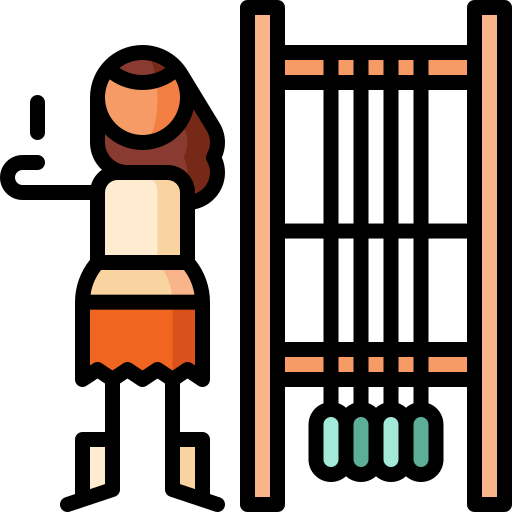

[](https://github.com/marcellomontemagno/react-ufo/actions)

<p align="center">
  
  <br/>
  parcae
  <br/>
  Programmatically step through asynchronous code during test
</p>

## Introduction

`parcae` is a tiny utility allowing you to programmatically step through asynchronous code during test.

Some example where `parcae` can be handy:

- Test complex loading state on a user interface
- Reproduce race conditions
- Test any function containing non-trivial asynchronous logic

## Installation

`npm install --save parcae`

```js
import createFutures from "parcae"
```

## How to use

Initialize the utility

```js
const futures = createFutures()
```

mock the asynchronous functions you want to control making them return

```js
futures.predict("aKey")
```
 
make a function resolve and await for it by invoking

```js
await futures.resolve("aKey", aResult)
```

otherwise, make a function reject and await for it by invoking

```js
await futures.reject("aKey", anError)
```

## Examples

[Basic example](https://github.com/marcellomontemagno/parcae/blob/main/src/module/examples/asyncSequence/asyncSequenceExample.test.js)

[UI example](https://github.com/marcellomontemagno/parcae/blob/main/src/module/examples/ui/UI.test.js)
